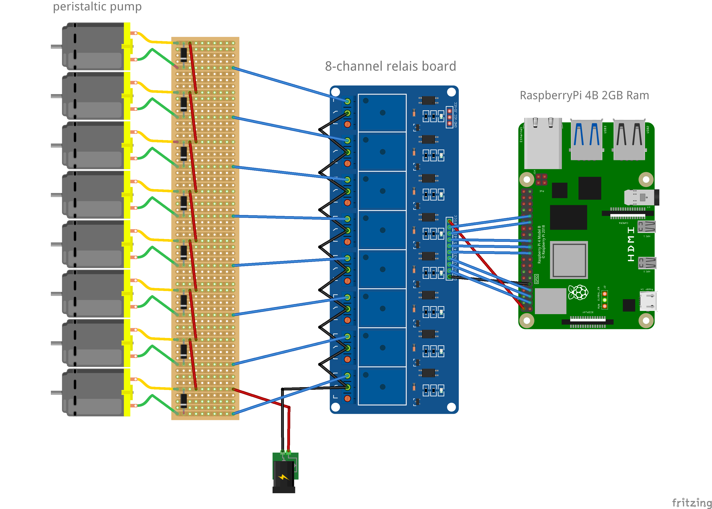

# CocktailMaker

The “Cocktail-Maker” is not only a piece of software. 
It’s a cocktail-mixing-machine, that works with a Raspberry-Pi, 
that controls multiple pumps, which have different ingredients assigned. 
The Cocktail-Maker provides a UI, that can be accessed via web browser. 
Admins can create other users and assign them to multiple roles with 
different permissions. Users can create own cocktails and if the 
Cocktail-Maker has all the needed ingredients, they can order them. 
Cocktails can be categorized and shared with other users.

New recipes can be created in the UI. The user can add ingredients to 
different production steps. Ingredients that are in the same 
production step get bottled at the same time. 
The order in which ingredients get bottled can be changed via drag & 
drop.

# Demo
A demo can be found here: https://cocktailmaker-demo.liggesmeyer.net/
User: Admin  
Password: 123456  

# Build the hardware

In order to use this machine in a useful way, you need to build your own hardware.
In simple words produces the Cocktail-Maker-Software different recipes by 
controlling a relay board, that opens or closes the electronic circuit 
for multiple pumps, which pump the different liquids into the glass.
The user can add new pumps in the webinterface, where he has to specify a GPIO-Pin
for every pump and how long that pumps needs to pump exactly one centiliter in 
milliseconds. You can build your machine as you like. The only important thing
is that you need to be able to apply that concept to your setup. This is an example setup:

### This is the hardware that I've used for my machine:
 * 1x RaspberryPi: https://amzn.to/3NYmSvH (Other platforms like NanoPi or BananaPi are not supported)
 * 1x Relay-Board: https://amzn.to/3yIcjrk
 * 8x Dosing pumps: https://amzn.to/3NWLPry / or with prime: https://amzn.to/3Obbvkm
 * 8x Diodes (reverse current diodes)
 * 1x 9V Power supply: https://bit.ly/2ZJPIcP
 * Silicone hose: https://amzn.to/3AJXmHA
 * Cables
 
### Fancy stuff.
You can also use this (additional) hardware to improve your setup even more:
 * 1x Touchscreen 7 inch: https://amzn.to/3uJ2wQr
 * 16x 12V Dosing pump: https://amzn.to/3P5PWmi (More expensive, but I was told that the pump is also more quiet)
 * 1x 16-Channel Relay-Board: https://amzn.to/3ayIfpX
 * 1x 12V power supply: https://amzn.to/3IxwDA1 (Can be used with 12V pumps)
 * 1x 12V power stabalizer: https://amzn.to/3uFtsAw (Can be used to power the machine by battery)
 * 1x 5V step down power supply: https://amzn.to/3Rsmb0J (for the raspberry)
 * 4x Rectifier diode: https://amzn.to/3yyz3tK (If you use the power supply and the power stabalizer)
 * 1x LAN-Cable box: https://amzn.to/3P66ril (For the case)

# Installation

An installation tutorial can be found here: https://github.com/alex9849/pi-cocktail-maker/wiki/Installation
